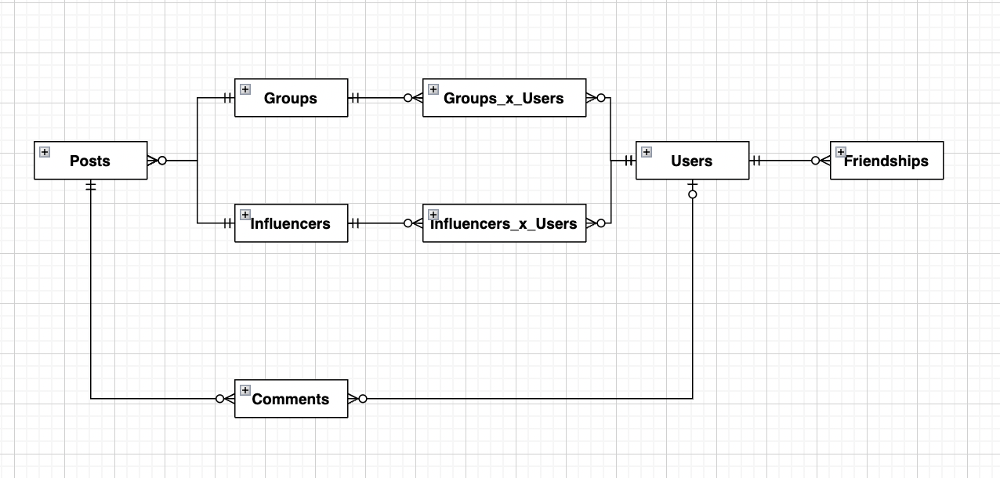
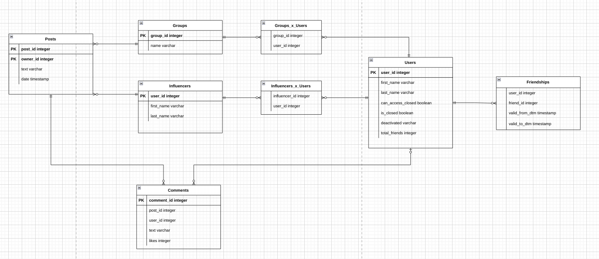

# Проектирование БД

## Предметная область

Предметной областью данной базы данных будет социальная сеть ВК.

## Ключевые сущности

- Пользователь
- Группа
- Инфлюенсер
- Пост
- Комментарий

## Описание связей

1) Пользователь - Группа

В группе находятся ноль или много пользователей. Один пользователь может находиться в нуле или многих группах. После приведения к нормальной форме создаётся соединяющая таблица. 

2) Пользователь - Инфлюенсер

В подписчиках инфлюенсера находятся ноль или много пользователей. Один пользователь может находиться в нуле или многих списках подписчиков. После приведения к нормальной форме создаётся соединяющая таблица. 

3) Пользователь - Пользователь

У одного пользователя может быть ноль или много друзей-пользователей. После приведения к нормальной форме создаётся соединяющая таблица.

4) Группа - Пост

В группе выходят посты - их может быть ноль или много. Каждый пост принадлежит одной группе.

5) Инфлюенсер - Пост

На стене пользователя выходят посты - их может быть ноль или много. Каждый пост принадлежит одному инфлюенсеру.

6) Пост - Комментарий

К посту пишутся комментарии. Под одним постом ноль или много комментариев. Каждый комментарий лежит под одним постом.

7) Пользователь - Комментарий

Пользователи пишут комментарии. У одного пользователя может быть несколько комментариев. У одного комментария всего один автор-пользователь, который, однако может не содержаться в данном социальном графе, так что ноль или один автор-пользователь. 

## Концептуальная модель

## Логическая модель

## Физическая модель

[Описание](physical.md)

## Запросы

Общая суть проекта: сбор и поддержка в свежем состоянии некоторого социального графа сети ВКонтакте. Затем периодически к базе данных будут поступать запросы - получить некоторую информацию из БД, чтобы продвигать некоторый целевой аккаунт в этом социальном графе.

Планируется разделить запросы на две категории
1) Обновление записей в таблице:
- Добавление групп
- Добавление инфлюенсеров
- Добавление пользователей из групп и инфлюенсеров
- Добавление дрежеских связей
- Обновление этих связей между сущностями, поддержание их 
2) Запросы к БД
- Несколько лучших кандидатов из таблицы Users
- Комментарии, которые писал некоторый Пользователь
- Комментарии, которые находятся в данной группе
- Самый популярный комментарий к некоторому посту
